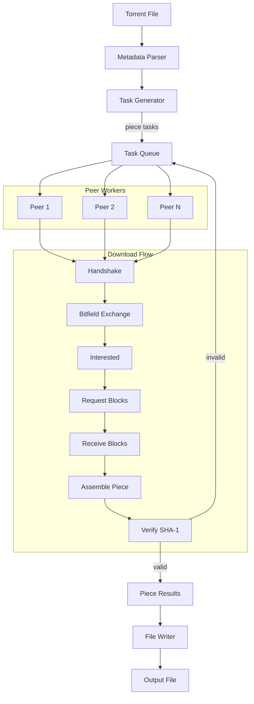

# ⚡ Minimal BitTorrent Client (Go)

A minimal BitTorrent client written in Go 🚀 that demonstrates core peer-to-peer file sharing concepts like handshake, piece exchange, and integrity verification.

---

## 📦 Features

- 🤝 Peer handshake & connection
- 📡 BitTorrent wire protocol support
- 🧩 Piece-based downloading (16KB blocks)
- 🔐 SHA-1 integrity verification
- ⚙️ Concurrent workers (multi-peer support)
- 💾 Random-access file writing
- 📊 Download progress tracking
- 🧪 CLI flags for flexible usage

---

## 👨‍💻 Usage

```bash
go run cmd/main.go tmp/sample.torrent tmp/out.md
```

---

## 🏗️ Architecture


